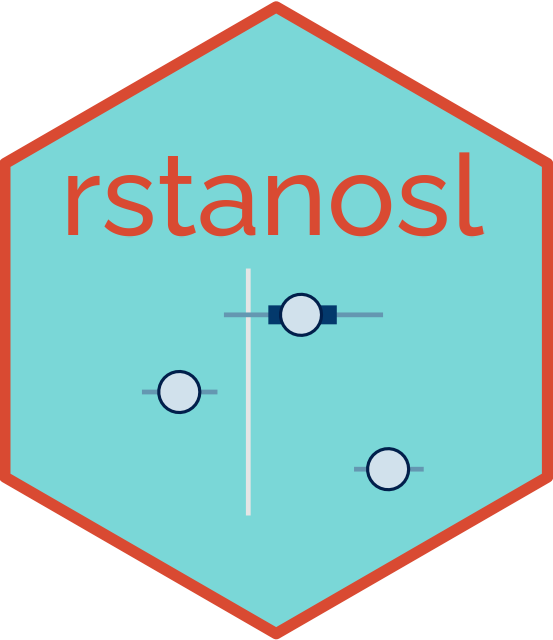

---
output:
  github_document:
    html_preview: false
---

```{r setup, include=FALSE}
knitr::opts_chunk$set(echo = TRUE, warning = FALSE, message = FALSE)
```



# rstanosl

`rstanosl` is an R package for fitting Optical Stimulated Luminescence (OSL) models using Stan.

## Installation

You can install the development version of `rstanosl` from GitHub with:

```{r eval=FALSE}
devtools::install_github("zaandahl/rstanosl")
```

If you want you can also install the package with a vignette. This will take a few minutes to create:

```{r eval=FALSE}
devtools::install_github("zaandahl/rstanosl", build_vignettes = TRUE)
```

## Getting Started

Load the package:

```{r eval=FALSE}
library(rstanosl)
```

Load the example data:

```{r eval=FALSE}
library(rstanosl)
```

Fit a ALMM model to a single depth layer of the data:

```{r eval=FALSE}
osl_data_46 <- osl_data %>% filter(Depth == 46)
almm_fit <- almm(osl_data_46, logged = T, sigma = NULL, refresh = 0)
```

## Further Resources

- [Getting Started with rstanosl Vignette](link-to-vignette): A step-by-step guide to using the rstanosl package with example data.
- [Stan documentation](https://mc-stan.org/users/documentation/): Learn more about Stan, a probabilistic programming language for statistical modeling.

## Building this package with `devtools` README and vignette

You can build this package from a Docker container that runs RStudio Server with the following commands:

```{bash eval=FALSE}
docker compose build
docker compose up
```

Then, open a web browser and navigate to http://localhost:8787. Log in with username `rstudio` and password `rstudio`. Then, run the following commands in the RStudio console:

```{r eval=FALSE}
setwd("./package")
source("inst/logo/logo.R")
knitr::knit("README.Rmd", "README.md")
devtools::document()
devtools::build()
devtools::install(build_vignettes = TRUE)
```

After you have finished building the package you can load in RStudio and save it as a tarball:

```{r eval=FALSE}
library(rstanosl)
save.image()
```

Then, you can exit the Docker container by pressing `Ctrl+C` in the terminal window where you ran `docker compose up`. Finally, you can remove the Docker container with the following command:

```{bash eval=FALSE}
docker compose down
```


## License

Your package license information (e.g., MIT, GPL-3, etc.)
